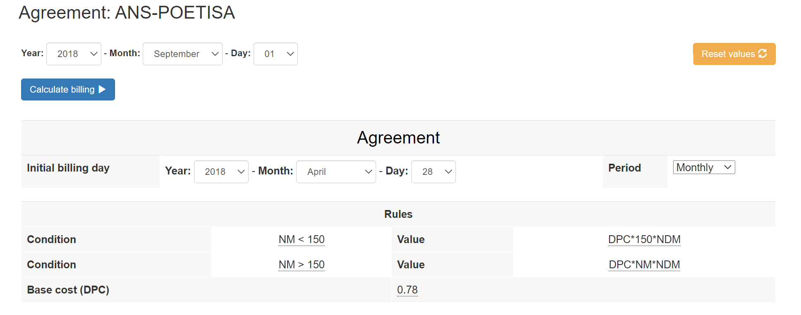
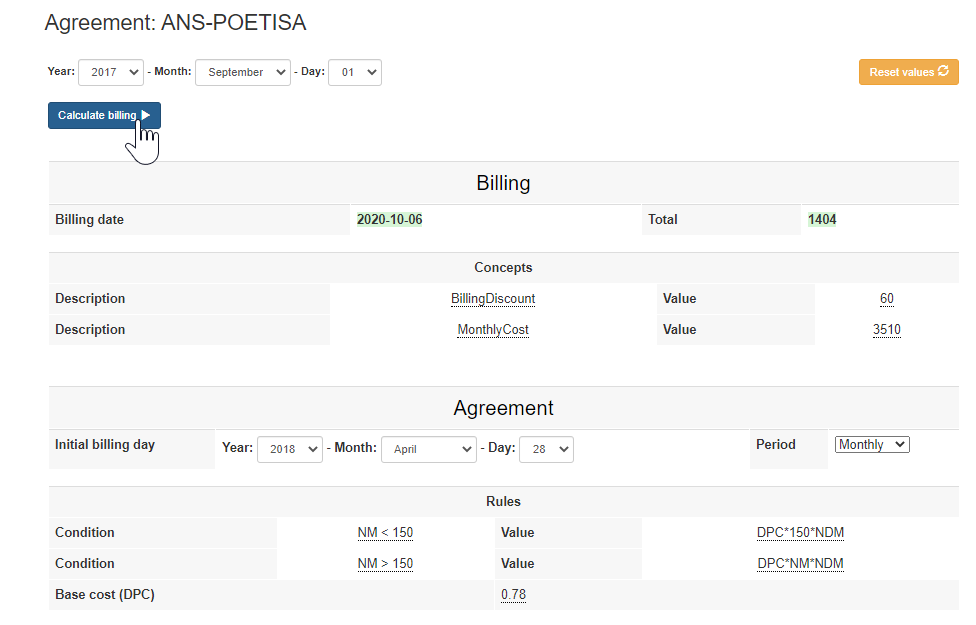

# POETISA Billing Manager

This is the landing page of the POETISA protype as described in the paper [A Flexible Billing Life Cycle for Cloud Services using Augmented Customer Agreements](https://isa-group.github.io/2020-10-billing-lifecycle/)


The POETISA Billing Manager provides a customizable engine to generate bills taking into account a richful SLA Model that can contain multiple compensations (penalties / rewards). As input data the protoype analyze the monitoring data (stored in [InfluxDB](https://github.com/influxdata/influxdb)) of the infaestructure (Following the conventions of Container Cluster Monitoring and Performance Analysis for [Kubernetes](https://github.com/kubernetes/kubernetes))


## System requirements

The software requirements are:
- Docker (v19 or above)
- NodeJS (v12 or above)

The system has been tested in the following environments:
 - Ubuntu 18.04.4 LTS
 - Catalina 10.15


## Quickstart guide

The installation steps are as folling (using a **bash shell**): 

1.  Get the Setup code
```bash
 npx degit isa-group/governify-project-poetisa poetisa
```

2. Run setup
```bash
 cd poetisa
 /bin/bash setup.sh
```

3. Check system
In a browser, access: `http://localhost:8088/` with the credentials `poetisa`/`poetisa` (you can change this defaults by modifying the [configuration](https://github.com/isa-group/governify-project-poetisa-render/blob/master/src/backend/configurations/config.yaml)), you should see the poetisa ui: 




## First steps

In order to test the system we can import the sample dataset of monitoring data in a real infrastructure (In the period **from April 2016 to Nov. 2017**) running the following command (in the `poetisa` folder as created in the Quick Start guide above):
```bash
/bin/bash import-data.sh
```

By default, when starting the system the UI shows a default Agreement from the example described in the [paper](https://isa-group.github.io/2020-10-billing-lifecycle/). This default agreement can be modified in the UI for ephemeral tests or in the [sla model configuration file](https://github.com/isa-group/governify-project-poetisa-render/blob/master/src/frontend/index/model.json) for a permanent change.

In order to calculate the billing for a given month, the period mus be selected and then press *Calculate Billing* button.


